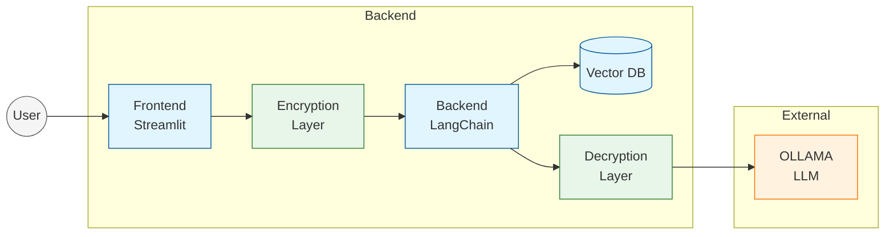

## Sec-ConvAgent

this a project related into Security Conversation over Agent-User to enhance the Privacy-data Driven Fully Encryption-Decryption Mechanism Conversation between Agent and User

#### the Architecture system design 




this project include the following steps :

1. building agent connected with vector Database embedding to store the Conversation History 
2. Decrypting and Encrypting Mechanisms of the conversation between Agent and User 
3. all the conversation being Stored Encryption Level 
4. Retrieval-Augmentation-Generation technique to improve the Agent Response up-to data knowledge 
5. using Genmi Api key Ollama Compatibility 


### installation

**Note** : you need to set up the environment variables before running the Streamlit app. `.env` file is used for this purpose.

1. create a virtual environment
```bash
python -m venv Sec-Agent
source Sec-Agent/bin/activate
```

2. install dependencies
```bash 
git clone https://github.com/Agentic-OS/Sec-ConvAgent.git
pip install -r requirements.txt && streamlit run app.py
```

3. Run Docker-compose
```bash
docker-compose up -d    
```
#### the techno used 

- LangChain 
- langaph 
- Chorma 
- cryptography
- request 


## Features

* Secure conversational interface
* Personalized experience through vector store management
* Data security through encryption and secure storage
* Access control mechanisms for authorized users Key Managemen

## System Design

The system consists of the following components:

* Frontend: Built using Streamlit, provides a web-based interface for users to interact with the chat application
* Backend: Responsible for handling user input, processing messages, and generating responses using LangChain
* Vector Store: Stores user messages and their corresponding embeddings (vector representations) for personalized experience
* Encryption: Uses cryptography to encrypt and decrypt user messages for secure storage and transmission
* Model: Utilizes a  (OLLAMA) DeepSeek-R1 model to generate responses to user queries

## Technical Requirements

* Python 3.10 or later
* Streamlit 1.29.0 or later
* LangChain 0.1.0 or later
* Cryptography 41.0.0 or later
* OLLAMA model (deepseek-r1:1.5b)


